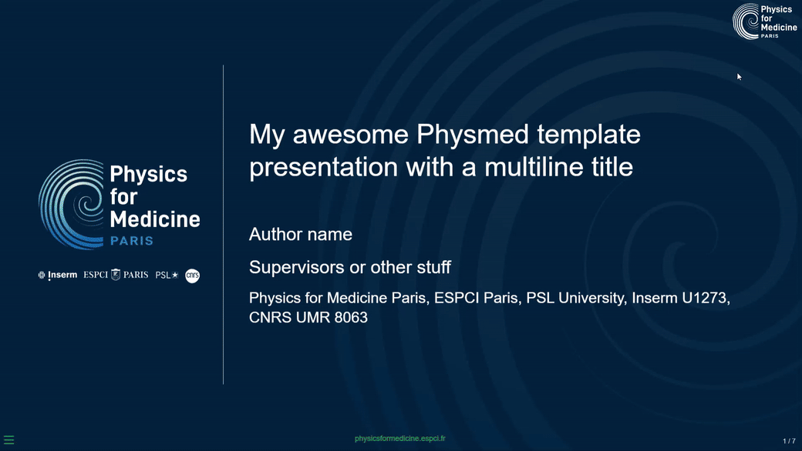

# Quarto Physmed revealjs template

A revealjs slide template for the Physics for Medicine Paris institute. Very much
inspired by formats found in [Awesome quarto#Presentation formats](https://github.com/mcanouil/awesome-quarto?tab=readme-ov-file#real-life-examples)
<a href='https://felipecybis.github.io/quarto-rladies-theme/' target='_blank'>
</a>

The logo in the top right corner of the slides are rendered in white when the slide has
a dark blackground by using the following config in `physmed.scss`

```scss
.reveal.has-dark-background .slide-logo {
  filter: brightness(0) invert(1) !important;
}
```

## Title image

The `title-image` option is available using the `physmed-revealjs`. This adds the image
on the left in the title slide.  
Use `title-image: ""` to remove it.

## Use

Depending on your use case, here are some [Quarto CLI](https://quarto.org/)
commands to get started.

If you would like to add the **physmed** theme to an existing directory:

```bash
quarto install extension felipecybis/quarto-physmed-template
```

Alternatively, you can use a
[Quarto template](https://quarto.org/docs/extensions/starter-templates.html)
that bundles the **physmed** theme plus a .qmd starter document. This is a better
option if you are starting a new project from scratch, since it will automatically
create a new directory with all of the necessary scaffolding in one go.

- Bare bones template

```bash
quarto use template felipecybis/quarto-pythmed-template
```
